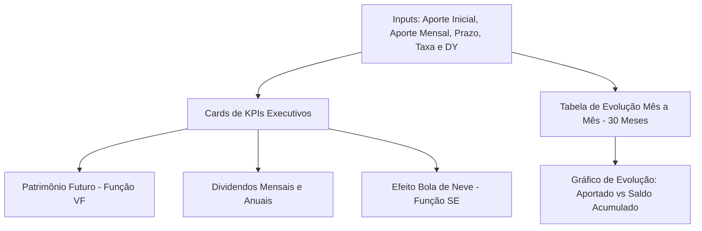

# 📊 Controle de Investimentos & Simulador Financeiro em Excel
### Modelagem Financeira, Projeção Patrimonial & Efeito Bola de Neve

<div align="center">


</div>

---

## 📌 Sumário
- [📖 Sobre o Projeto](#-sobre-o-projeto)
- [🎯 Principais Recursos](#-principais-recursos)
- [⚙️ Arquitetura da Planilha `Controle de Investimentos.xlsx`](#️-arquitetura-da-planilha-controle-de-investimentosxlsx)
- [🧮 Modelagem Matemática e Fórmulas Utilizadas](#-modelagem-matemática-e-fórmulas-utilizadas)
- [❄️ O Conceito do Efeito Bola de Neve (Magic Number)](#️-o-conceito-do-efeito-bola-de-neve-magic-number)
- [💡 Sugestões de Expansão e Boas Práticas](#-sugestões-de-expansão-e-boas-práticas)
- [📁 Estrutura do Repositório](#-estrutura-do-repositório)
- [🚀 Como Utilizar e Testar a Planilha](#-como-utilizar-e-testar-a-planilha)
- [📜 Licença](#-licença)

---

## 📖 Sobre o Projeto

Este repositório contém uma solução completa e versátil voltada para **Controle de Investimentos e Simulação Financeira Multiativos**, aplicável a carteiras de Fundos Imobiliários (FIIs), Ações de Dividendos, Renda Fixa com aportes regulares e Tesouro Direto.

O projeto tem como núcleo o arquivo **[`Controle de Investimentos.xlsx`](Controle de Investimentos.xlsx)**, uma planilha interativa, elegante e intuitiva desenvolvida para automatizar cálculos de juros compostos, projeção de patrimônio, acúmulo de proventos e monitoramento do ponto de virada financeira conhecido como **Efeito Bola de Neve** (*Magic Number*).

A ferramenta foi projetada com arquitetura abrangente, permitindo que qualquer investidor consiga planejar com clareza:
1. Quanto seu patrimônio crescerá ao longo dos anos com aportes constantes e reinvestimento dos proventos.
2. Qual será sua renda passiva mensal estimada em dividendos e juros.
3. Em que momento os rendimentos gerados pelos investimentos passarão a cobrir e superar o próprio aporte mensal.

---

## 🎯 Principais Recursos

- [x] **Construção de Ferramenta Financeira Prática:** Aplicação de funções financeiras essenciais do Excel (`VF` / `FV`, `SE` / `IF`, fórmulas dinâmicas).
- [x] **Automatização de Cálculos Complexos:** Total aportado, valor futuro projetado, lucro acumulado em juros e estimativa de dividendos mensais e anuais.
- [x] **Visualização com Tabela e Gráficos:** Tabela progressiva mês a mês e gráfico de linhas destacando o distanciamento exponencial entre o capital aportado e o patrimônio total.
- [x] **Interface Executiva e Intuitiva:** Organização em blocos visuais claros (Inputs $\rightarrow$ Cards de KPIs $\rightarrow$ Tabela de Projeção $\rightarrow$ Gráfico).
- [x] **Documentação Técnica Completa:** Guia com equivalências de fórmulas em Português e Inglês e fundamentos de modelagem financeira.

---

## ⚙️ Arquitetura da Planilha `Controle de Investimentos.xlsx`

A planilha organiza o fluxo de análise de forma lógica e sequencial:



### 1. Painel de Parâmetros de Investimento (`Inputs: B5:D10`)
Área reservada para personalização pelo usuário:
- **Aporte Inicial (`C6`):** Capital inicial de largada (padrão: `R$ 5.000,00`).
- **Aporte Mensal (`C7`):** Capacidade de poupança mensal (padrão: `R$ 1.000,00`).
- **Prazo em Anos (`C8`):** Duração da estratégia (padrão: `10 anos = 120 meses`).
- **Taxa Rendimento (% a.m.) (`C9`):** Rendimento total composto mensal (padrão: `0,85% a.m.` $\approx 10,7\%$ a.a.).
- **Dividend Yield (% a.m.) (`C10`):** Proventos líquidos mensais (padrão: `0,60% a.m.` $\approx 7,4\%$ a.a.).

### 2. Painel de Resumo Executivo (Cards de KPIs - `F5:K10`)
- **Patrimônio Acumulado (`F6`):** `R$ 221.014,14` (calculado via função financeira `VF` para 120 meses).
- **Total Aportado (`H6`):** `R$ 125.000,00` (capital real desembolsado pelo investidor).
- **Lucro em Juros (`I6`):** `R$ 96.014,14` (ganho líquido proporcionado pelos juros compostos).
- **Dividendos Mensais (`J6`):** `R$ 1.326,08 / mês` (renda passiva mensal estimada ao fim do período).
- **Efeito Bola de Neve (`F10`):** `ATIVADO! (Proventos > Aporte)` (condição dinâmica via função `SE`).
- **Renda Anual em Dividendos (`H10`):** `R$ 15.913,02 / ano`.
- **Cobertura do Aporte Mensal (`J10`):** `132,61%` (proventos cobrem 1,32x o valor do aporte!).

### 3. Tabela de Projeção Mês a Mês (`Table_1` - Linhas 13 a 43)
Acompanhamento detalhado da evolução patrimonial ao longo dos primeiros 30 meses:
- **Mês:** Contador de 1 a 30.
- **Saldo Inicial:** Inicia com o aporte inicial e recebe o saldo final do mês anterior.
- **Aporte:** Depósito mensal recorrente de R$ 1.000,00.
- **Rendimento:** Ganho percentual sobre o saldo em conta.
- **Saldo Final Acumulado:** Soma de Saldo + Aporte + Rendimento.
- **Total Aportado:** Montante desembolsado do bolso do investidor.
- **Dividendos Estimados:** Geração de caixa mensal correspondente ao saldo acumulado.

### 4. Gráfico Dinâmico de Evolução Patrimonial
Gráfico de linhas intitulado *"Evolução Patrimonial: Total Aportado vs. Saldo Acumulado"*, demonstrando visualmente o efeito da aceleração dos juros compostos no decorrer do tempo.

---

## 🧮 Modelagem Matemática e Fórmulas Utilizadas

A planilha foi construída com fórmulas compatíveis com o Excel internacional e brasileiro:

| Métrica / Campo | Fórmula em Inglês (EN-US) | Fórmula em Português (PT-BR) | Finalidade |
| :--- | :--- | :--- | :--- |
| **Patrimônio Final** | `=FV(C9, C8*12, -C7, -C6)` | `=VF(C9; C8*12; -C7; -C6)` | Projeta o valor futuro da série periódica com depósito inicial. |
| **Total Aportado** | `=C6+(C7*C8*12)` | `=C6+(C7*C8*12)` | Soma do capital inicial com os aportes dos 120 meses. |
| **Lucro em Juros** | `=F6-H6` | `=F6-H6` | Subtrai o total aportado do patrimônio acumulado. |
| **Dividendo Mensal** | `=F6*C10` | `=F6*C10` | Aplica a taxa de Dividend Yield sobre o patrimônio final. |
| **Status Bola de Neve** | `=IF(J6>=C7, "ATIVADO! (Proventos > Aporte)", "EM FORMAÇÃO")` | `=SE(J6>=C7; "ATIVADO! (Proventos > Aporte)"; "EM FORMAÇÃO")` | Avalia dinamicamente se a renda passiva já superou o aporte. |
| **Renda Anual** | `=J6*12` | `=J6*12` | Anualiza a renda mensal estimada em proventos. |
| **Cobertura de Aporte** | `=J6/C7` | `=J6/C7` | Calcula a razão entre dividendos recebidos e o valor aportado. |
| **Rendimento no Mês** | `=(C14+D14)*$C$9` | `=(C14+D14)*$C$9` | Calcula o rendimento mensal da tabela dinâmica. |

> 📘 **Para aprofundamento na matemática financeira:** Consulte [`FORMULAS_E_METRICAS.md`](FORMULAS_E_METRICAS.md).

---

## ❄️ O Conceito do Efeito Bola de Neve (Magic Number)

No universo dos investimentos geradores de renda, o **Efeito Bola de Neve** (ou *Número Mágico*) representa o divisor de águas na vida financeira:

$$\text{Proventos Mensais Recebidos} \ge \text{Aporte Mensal Regular}$$

Quando essa condição é atingida:
1. O investidor não precisa mais depender exclusivamente do próprio salário para continuar investindo.
2. A carteira torna-se **autossustentável**: o próprio fluxo de dividendos reinvestido compra novas cotas e ativos todos os meses.
3. No modelo da planilha, com aportes de R$ 1.000/mês e rendimento de proventos de 0,60% a.m., o efeito bola de neve é atingido plenamente antes dos 10 anos, gerando **R$ 1.326,08/mês** (cobertura de **132,6%**)!

---

## 💡 Sugestões de Expansão e Boas Práticas

Para enriquecer ainda mais a ferramenta em estudos futuros, sugerem-se as seguintes possibilidades de expansão:

### 1. Harmonização do Prazo com Marcos de Cenários
- **Cenário Atual:** O input define 10 anos (120 meses), enquanto a tabela apresenta o detalhamento dos primeiros 30 meses.
- **Possibilidade:** Adicionar uma pequena tabela lateral com **Marcos de Cenários** para 1 ano (12m), 2 anos (24m), 5 anos (60m) e 10 anos (120m). Dessa forma, a planilha permanece leve e intuitiva, oferecendo simultaneamente a visão detalhada de curto prazo e a visão macro de longo prazo.

### 2. Módulo de Alocação por Classe de Ativos
- Adicionar uma pequena seção para distribuição percentual do aporte mensal (`$C$7` = R$ 1.000,00) entre diferentes classes:
  - **Fundos Imobiliários de Tijolo / Papel:** R$ 500,00 (50%)
  - **Ações Pagadoras de Dividendos:** R$ 300,00 (30%)
  - **Renda Fixa / Tesouro Direto:** R$ 200,00 (20%)

### 3. Nomes Definidos no Excel (Name Manager)
- Nomear células estratégicas como `Aporte_Inicial` e `Aporte_Mensal` para que as fórmulas fiquem autodocumentadas e ainda mais legíveis para novos usuários.

### 4. Fórmulas Bilíngues
- Manter o guia com equivalências entre `VF` / `FV` e `SE` / `IF` para assegurar que a planilha funcione sem erros em qualquer versão de idioma do Microsoft Excel.

---

## 📁 Estrutura do Repositório

```text
controle-de-investimentos/
│
├── .gitignore                    # Regras de exclusão de arquivos temporários do Office
├── Controle de Investimentos.xlsx # Planilha principal desenvolvida para simulação
├── FORMULAS_E_METRICAS.md        # Documentação matemática e técnica detalhada
└── README.md                     # Documentação oficial do projeto
```

---

## 🚀 Como Utilizar e Testar a Planilha

1. **Abra o arquivo:**
   - Abra [`Controle de Investimentos.xlsx`](Controle de Investimentos.xlsx) no Microsoft Excel, Excel Online ou Google Planilhas.
2. **Experimente novos cenários alterando as células em destaque:**
   - Mude o **Aporte Inicial** (`C6`) para R$ 1.000,00 ou R$ 10.000,00.
   - Ajuste o **Aporte Mensal** (`C7`) de acordo com sua capacidade de poupança.
   - Modifique o **Prazo** (`C8`) para ver o impacto no patrimônio final e nos dividendos.
   - Observe o indicador **Efeito Bola de Neve** mudar de status automaticamente conforme a renda supera o aporte!

---

## 📜 Licença

Distribuído sob a licença [MIT](https://opensource.org/licenses/MIT). Sinta-se livre para usar, aprimorar e compartilhar!

---

<div align="center">

*Construindo patrimônio com inteligência, método e disciplina financeira.* 📈

</div>
